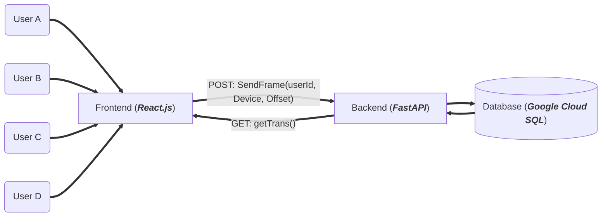
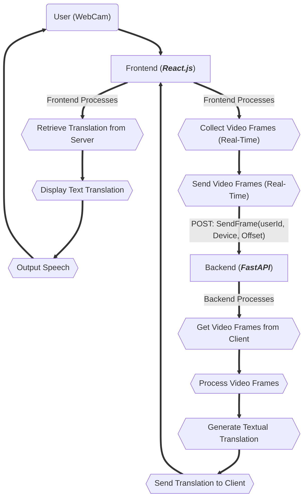

# TranslAItor
## Let's Bridge the Gap Between Sign-Language and Verbal Languages

The translAItor app is an innovative web-based platform designed to bridge communication gaps by translating sign language into spoken language in real time. Users can access the app through a web browser, where they can use their webcam to input sign language gestures, with a translation of their gestures being outputed in real-time via text as well as speech in a language of their choosing.

## Non-Technical Requirements

- User Experience (UX) Design:
    - An intuitive and easy-to-navigate interface, designed with accessibility in mind to accommodate diverse users, including those with disabilities.
    - UI  should be simple in terms of only core functionality should be exposed to user
- Scalability:
    - The system should be scalable to handle varying loads of users and data processing needs without degradation in performance.
- Extendability:
    - Multiple sign languages should be supported and recognized as well as translation to multiple verbal languages should be supported as well
- Documentation:
    - Comprehensive documentation covering how to use the site, API documentation for future developers, and system architecture explanations.
- Training and Support:
    - User training materials, FAQs, and support mechanisms to help users understand how to use the website effectively.
    - Developer support for future modifications and troubleshooting.
- Testing and Quality Assurance:
    - Plans for rigorous testing including unit tests, integration tests, and user acceptance tests to ensure reliability and effectiveness of the website.
- Ethical Considerations:
    - Guidelines and policies to manage ethical concerns, particularly related to AI and biometric data usage.
- Compliance and Legal:
    - Compliance with data protection laws such as GDPR for handling personal data, and possibly HIPAA if considered necessary.
    - Compliance with web accessibility standards to ensure the site is usable by people with various disabilities.

## Technical Requirements

- Webcam Access:
    - Ability to access and control the user’s webcam through the browser for real-time video capture.
- Real-time Video Processing:
    - Capabilities to process video input in real time to detect and interpret sign language gestures.
- Sign Language Recognition Model:
    - A machine learning model capable of recognizing and interpreting various sign language gestures from video input.
    - The model will run server-side (using TensorFlow or PyTorch with Python).
- Backend Server:
    - A robust backend using FASTAPI capable of handling requests, integrating with the AI model, and managing data flow.
- Speech Synthesis:
    - Integration of text-to-speech technology to convert the interpreted text into audible speech, possibly using Web Speech API or other libraries.
- Frontend Development:
    - A responsive and accessible user interface built with React.js that provides real-time feedback and interactive elements for users.
- APIs for Communication:
    - REST API or WebSocket API for smooth communication between the frontend and the backend, particularly for transmitting video frames and receiving processed data.
- Database Management:
    - (Optional) A database to log user sessions, store historical data, or manage user accounts, if needed.
- Security Measures:
    - (Optional) Implementations to ensure data privacy and security, including secure data transmission and storage, and compliance with relevant regulations.

## Systems Design

- **Users (A, B, C, D)**
  - Represents different clients accessing the system, possibly with unique requirements and contexts.

- **Frontend (React.js)**
  - The user interface where interactions take place. Handles video stream input from users' webcams.
  - Sends video frames to the backend server via API calls (WebSockets/Long Pollling) and receives text translation data from server
- **Backend (FastAPI)**
  - The server-side logic that processes API requests.
  - Handles the core functionality including sign language processing and interaction with the database. Strictly handles the process in which it recieves video frames from client, interprets video frames, produces textual translation and sends client result

- **Database (Google Cloud SQL)**
  - Stores user data, translation logs, settings, and other persistent information.
  - Accessed by the backend to retrieve or store data as required by the application logic.

## Data Flow Diagram

